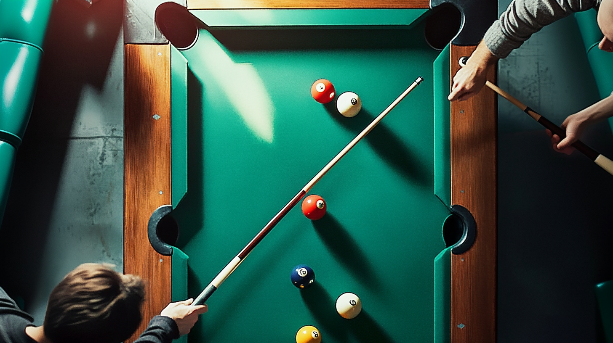

# Multiplayer 8-Ball Pool Game

A real-time multiplayer 8-ball pool game created using HTML, JavaScript, and peer-to-peer connectivity. Play pool with friends online without the need for a central server!



## Features

- **Real-time Multiplayer**: Play 8-ball pool with friends online using peer-to-peer connections
- **Realistic Physics**: Accurate ball collisions and movement physics
- **Intuitive Controls**: Easy-to-use cue aiming and power control
- **Game Rules**: Standard 8-ball pool rules with solids and stripes
- **Responsive Design**: Works on desktop and mobile devices
- **Dark/Light Mode**: Toggle between dark and light themes
- **No Server Required**: Direct peer-to-peer connections using PeerJS

## Getting Started

### Prerequisites

- Node.js (for development server)
- Modern web browser (Chrome, Firefox, Safari, Edge)

### Installation

1. Clone the repository:

   ```
   git clone https://github.com/williamli/multiplayer-8-ball-ai-vibe-coding.git
   cd multiplayer-8-ball-ai-vibe-coding
   ```

2. Install dependencies:

   ```
   npm install
   ```

3. Start the development server:

   ```
   npm run dev
   ```

4. Open your browser and navigate to:
   ```
   http://localhost:3000
   ```

## How to Play

1. **Starting a Game**:

   - Open the game in your browser
   - Grant necessary permissions (camera/microphone if applicable)
   - Create a new game or join an existing one with a game code

2. **Game Controls**:

   - Use your mouse/touch to aim the cue
   - Adjust power by dragging back
   - Release to take your shot
   - Follow standard 8-ball pool rules

3. **Winning the Game**:
   - Pocket all your assigned balls (solids or stripes)
   - Legally pocket the 8-ball to win

## Technologies Used

- HTML5 Canvas for game rendering
- JavaScript for game logic and physics
- PeerJS for peer-to-peer connections
- TailwindCSS for styling
- Flowbite for UI components

## Development

The game is built as a single HTML file with embedded JavaScript for simplicity. The main components include:

- Physics engine for ball movement and collisions
- Peer-to-peer networking for multiplayer functionality
- Game state management
- User interface and controls

## License

This project is licensed under the ISC License - see the [LICENSE](LICENSE) file for details.

## Author

William Li

## Acknowledgments

- PeerJS for the peer-to-peer connection library
- TailwindCSS and Flowbite for UI components
